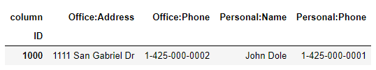
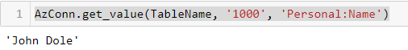

# Guide for simplehbase

### Installing simplehbase
- Download the simplehbase folder and setup.py
- Traverse to the folder where setup.py is and execute`pip install .`

### Connect to Azure Hbase
    import simplehbhase
    AzConn = simplehbase.AzHbaseRestAPI()
    AzConn.connectionParameters("<url of Azure Hbase Rest>", "<username>","<crendentials>")
The url of Azure Hbase Rest is typically in the format of https://$clustername.azurehdinsight.net/hbaserest/

### Create Table
    TableName = "testTable"
    CF = {"Personal", "Office"}
    AzConn.create_table(TableName, CF)

### Delete Table
    AzConn.delete_table("testTable")

### Insert Data
First create the data in this format
    
    data = [
    {"ID":"1000", "Personal:Name":"John Dole", "Personal:Phone": "1-425-000-0001", "Office:Phone":"1-425-000-0002", "Office:Address":"1111 San Gabriel Dr"},
    {"ID":"1001", "Personal:Name":"Peter Davids", "Personal:Phone": "123-123-123-1", "Office:Phone":"123-123-123-2", "Office:Address":"Far Far Away Land"},
    {"ID":"1002", "Personal:Name":"George Best"}
    ]

    df = pd.DataFrame.from_dict(data, orient='columns')
    df

Use the simplehbase.df_to_dict function to convert the Pandas DataFrame to Dictionary

    data = simplehbase.df_to_dict(df)
    data

Finally insert the data

    AzConn.insert_data(TableName, data)

### Retrieve Data by row_key
To retrieve all the data for a specific row_key

    AzConn.get_value(TableName, '1000')

To retrieve data for a specific column for a specific row_key

    AzConn.get_value(TableName, '1000', 'Personal:Name')

# Coming Up
- Method to scan data from Hbase

# References:
- https://docs.microsoft.com/en-us/azure/hdinsight/hbase/apache-hbase-tutorial-get-started-linux
- https://hbase.apache.org/1.2/apidocs/org/apache/hadoop/hbase/rest/package-summary.html
